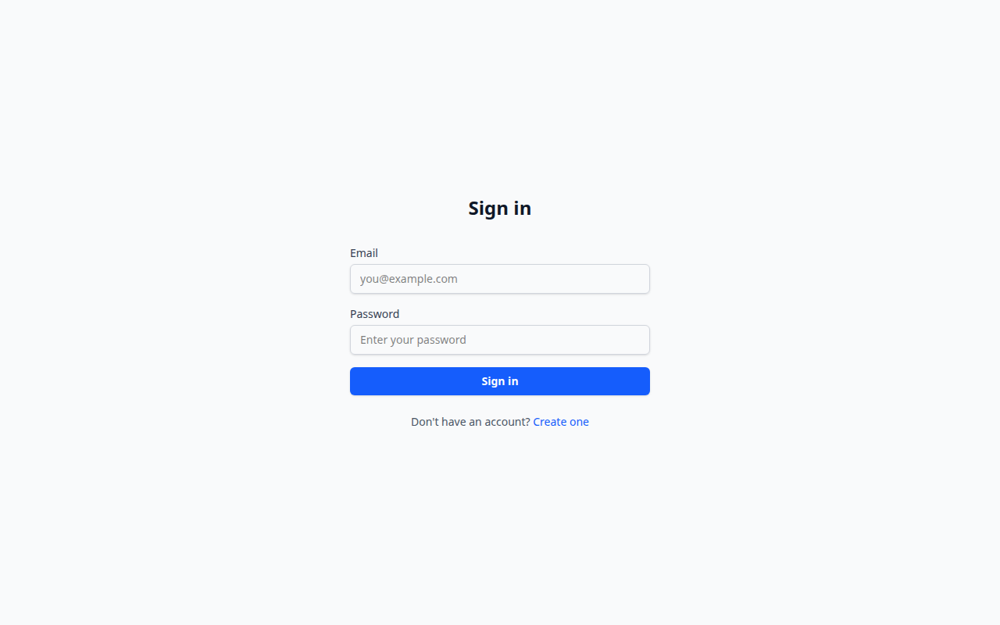
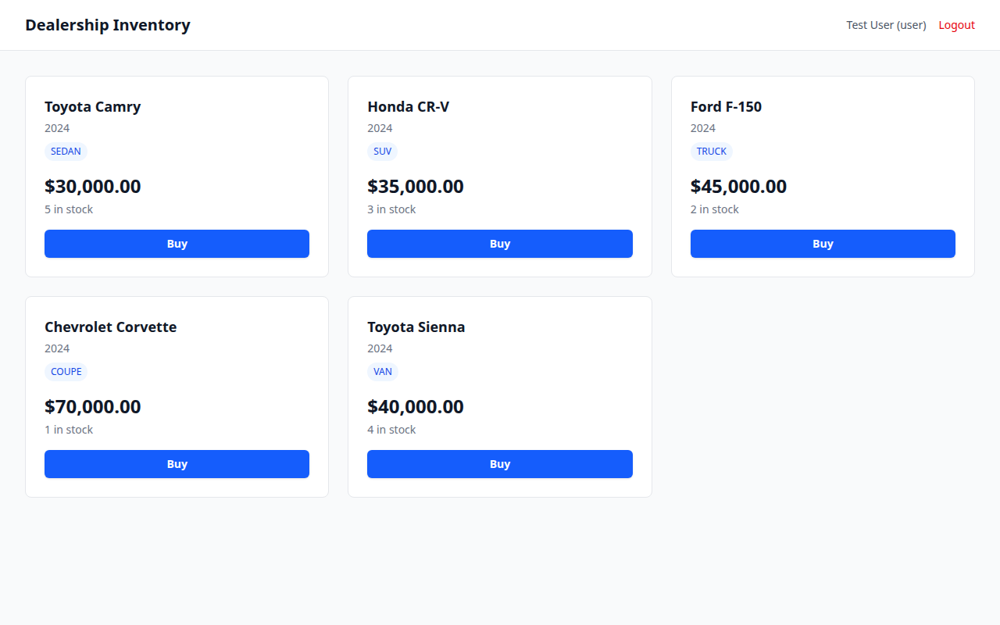

# Incubyte Project — Dealership Inventory Management

A full-stack vehicle inventory management system with authentication, role-based access control, and TDD-driven development.

## Tech Stack

| Layer | Technology |
|-------|-----------|
| **Runtime** | Node.js v24 |
| **Server** | Express + TypeScript |
| **Database** | Neon PostgreSQL (via Prisma ORM) |
| **Auth** | JWT (bcryptjs + jsonwebtoken) |
| **Validation** | Zod |
| **Client** | React 19 + TypeScript + Vite |
| **Styling** | Tailwind CSS v4 |
| **Testing** | Vitest + Testing Library + MSW |

## Setup

```bash
# Install all dependencies (server + client)
npm install

# Set up environment
cp .env.example .env

# Run database migration
npm run db:migrate -w server

# Seed the database (creates admin user + sample vehicles)
npm run db:seed -w server

# Start both server and client
npm run dev

# Or start individually:
npm run dev -w server   # http://localhost:3001
npm run dev -w client   # http://localhost:5173
```

### Default Credentials

| Role | Email | Password |
|------|-------|----------|
| Admin | admin@incubyte.com | password123 |
| User | user@incubyte.com | password123 |

## Deployment

### Live URLs

| Service | URL | Status |
|---------|-----|--------|
| **Client** | [https://incubyte-dealership.vercel.app](https://incubyte-dealership.vercel.app) | ✅ Live |
| **API** | `https://incubyte-dealership-api.onrender.com` | 🔧 Deploy via Render Dashboard (see below) |

### Architecture

```
                    ┌──────────────────────┐
                    │    Vercel (CDN)       │
                    │  React SPA (client/)  │
                    └──────────┬───────────┘
                               │ HTTP /api/*
                    ┌──────────▼───────────┐
                    │   Render (Web Service)│
                    │  Express API (server/)│
                    └──────────┬───────────┘
                               │ Prisma ORM
                    ┌──────────▼───────────┐
                    │  Neon PostgreSQL      │
                    │  (serverless, extern) │
                    └──────────────────────┘
```

- **Render** hosts the Express + TypeScript backend as a web service.
  - Build: `npm install && npm run build -w server`
  - Start: `npm run db:migrate -w server && npm run start -w server`
  - Plan: Free tier (spins down after inactivity).
- **Vercel** hosts the React client as a static SPA with client-side routing rewrites.
  - All unmatched routes rewrite to `/index.html` (handled by `vercel.json`).

### Deploy Backend on Render

1. Go to [Render Dashboard](https://dashboard.render.com/) → **New** → **Blueprint**
2. Connect your GitHub repo (`NotYash1066/Incubyte_Project`)
3. Render will detect `render.yaml` and pre-fill settings
4. **Before deploying**, add these environment variables manually (Render will prompt for `sync: false` vars):
   - `DATABASE_URL` — your Neon PostgreSQL connection string
   - `JWT_SECRET` — a strong random secret
5. Click **Apply** — Render will provision the web service (~3 min)
6. Once deployed, the API will be at `https://incubyte-dealership-api.onrender.com`

### Environment Variables

| Variable | Where | Description |
|----------|-------|-------------|
| `DATABASE_URL` | Render (manual) | PostgreSQL connection string (Neon) |
| `JWT_SECRET` | Render (manual) | Secret key for signing JWTs |
| `VITE_API_URL` | Vercel (set) | Frontend API target → `https://incubyte-dealership-api.onrender.com/api` |

## Running Tests

```bash
# All tests (server + client)
npm test

# Server only (48 tests)
npm test -w server

# Client only (25 tests)
npm test -w client
```

## API Reference

All endpoints except `POST /api/auth/*` require a `Bearer <token>` authorization header.

### Auth

| Method | Endpoint | Auth | Description |
|--------|----------|------|-------------|
| POST | `/api/auth/register` | No | Register a new user |
| POST | `/api/auth/login` | No | Login and get JWT token |

**Auth Response**: `{ token, user: { id, email, name, role } }`

### Vehicles

| Method | Endpoint | Auth | Role | Description |
|--------|----------|------|------|-------------|
| GET | `/api/vehicles` | Yes | Any | List all vehicles |
| GET | `/api/vehicles/:id` | Yes | Any | Get vehicle by ID |
| POST | `/api/vehicles` | Yes | Admin | Create vehicle |
| PUT | `/api/vehicles/:id` | Yes | Admin | Update vehicle |
| DELETE | `/api/vehicles/:id` | Yes | Admin | Delete vehicle |
| POST | `/api/vehicles/:id/purchase` | Yes | Any | Purchase a vehicle (decrements stock) |
| POST | `/api/vehicles/:id/restock` | Yes | Admin | Restock a vehicle (increments stock) |

**Vehicle fields**: `make`, `model`, `year`, `category` (SEDAN|SUV|TRUCK|COUPE|VAN), `price`, `quantity`

### Health

| Method | Endpoint | Description |
|--------|----------|-------------|
| GET | `/api/health` | Server health check |

## Architecture

```
incubyte-project/
├── server/                 # Express API server
│   ├── src/
│   │   ├── lib/            # Prisma client, AppError, asyncHandler
│   │   ├── middleware/      # auth, admin, errorHandler
│   │   ├── routes/          # auth, vehicles
│   │   ├── app.ts           # Express app setup
│   │   └── server.ts         # Server entry point
│   ├── prisma/
│   │   ├── schema.prisma    # User & Vehicle models
│   │   └── seed.ts          # Seed data
│   └── tests/               # 48 integration tests
└── client/                 # React SPA
    ├── src/
    │   ├── components/      # Navbar, ProtectedRoute
    │   ├── contexts/        # AuthContext
    │   ├── lib/             # apiRequest utility
    │   ├── pages/           # Login, Register, Dashboard, Admin, NotFound
    │   └── App.tsx          # Router + providers
    └── src/App.test.tsx     # 25 component tests
```

## Screenshots


*Login page with email and password fields*


*Dashboard showing vehicle inventory with search, filter, and purchase options*


*Admin panel for vehicle management (CRUD operations)*

## Test Report

### Server (48 tests, 5 test files)

| Test File | Tests | Coverage |
|-----------|-------|----------|
| `tests/auth.test.ts` | 8 | Register validation, duplicate email, login success/failure, auth middleware |
| `tests/vehicles.test.ts` | 16 | CRUD operations, admin-only enforcement, auth checks |
| `tests/inventory.test.ts` | 12 | Purchase flow, insufficient stock, restock, admin-only restock |
| `tests/app.test.ts` | 2 | Health check, 404 handling |
| `tests/search.test.ts` | 10 | Search by make/model/year, partial match, no-results, empty query |

### Client (25 tests, 1 test file)

| Test Group | Tests | Coverage |
|-----------|-------|----------|
| Auth | 3 | Unauthenticated redirect, navigation login↔register |
| Register | 4 | Password mismatch, short password, successful registration, API error |
| Login | 2 | Successful login, API error message |
| Dashboard | 8 | Vehicle list, price/stock, buy button disabled/enabled, unauthenticated redirect, search inputs, search filtering, API error state |
| Admin | 4 | Admin page rendering, add vehicle form, delete vehicle, restock |
| Access Control | 1 | Non-admin redirected from /admin |
| 404 | 3 | 404 page rendering, link to login unauthenticated, link to dashboard authenticated |

## AI Usage Disclosure

This project was developed using AI-assisted engineering through **OpenCode** (powered by Claude) as the primary development interface. Here is how AI was used:

### Development Process

The project followed a **TDD (Test-Driven Development)** methodology, but AI was leveraged through an orchestrator-agent architecture:

1. **Architecture & Planning**: The high-level architecture, technology choices, and work breakdown were designed by the human developer. AI was used to validate decisions and suggest alternatives.

2. **Test Writing**: All test cases (RED phase) were authored by AI based on the human developer's specification of endpoint behavior and edge cases.

3. **Implementation (GREEN phase)**: All production code was written by specialized AI sub-agents operating under strict constraints:
   - No `as any`, `@ts-ignore`, or type suppression
   - Must follow existing codebase patterns
   - All changes must pass tests before commit

4. **Orchestration**: The Sisyphus orchestrator agent managed task decomposition, parallel delegation, code review, and quality gates. Human developer provided continuous feedback and course corrections.

5. **Code Quality**: The `doubly-determined-development` approach was used — every implementation decision was verified against the test suite. The refactor phase (T11) introduced `AppError`, `asyncHandler`, and a global error handler to eliminate boilerplate.

### Tools Used

| Tool | Usage | Impact |
|------|-------|--------|
| OpenCode (Sisyphus) | Orchestration agent — decomposed tasks, delegated to specialists, enforced quality gates | Reduced cognitive overhead of task switching; ensured test-first discipline |
| Claude (via OpenCode) | Primary coding agent — wrote tests, implementation, and documentation | Accelerated development while maintaining type safety and TDD discipline |
| Neon (Serverless PostgreSQL) | Production and test database provisioned via `neon` CLI | Eliminated local DB setup overhead; enabled parallel test/development environments |

*This AI Usage Disclosure documents how AI was used throughout the development lifecycle, serving as a transparent record per Incubyte's apprenticeship requirements.*

### Verification

- All code was automatically verified: clean `lsp_diagnostics`, passing test suites, build success
- Commits are atomic per task with meaningful messages
- No code was merged without passing its test suite
